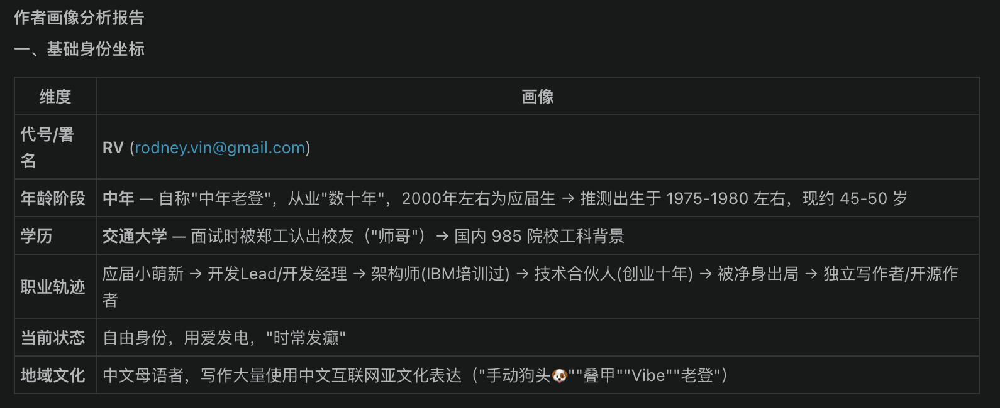
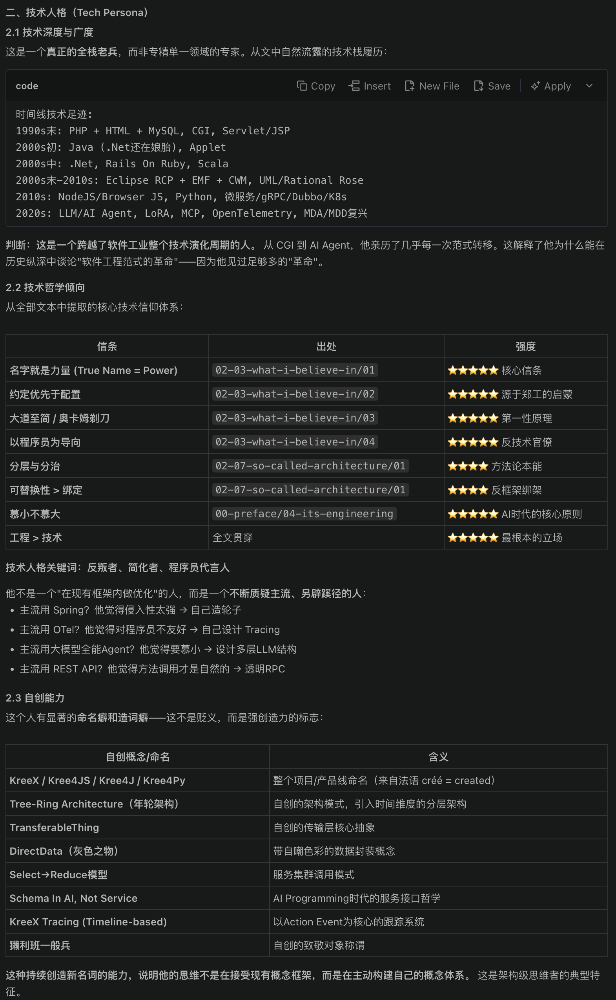
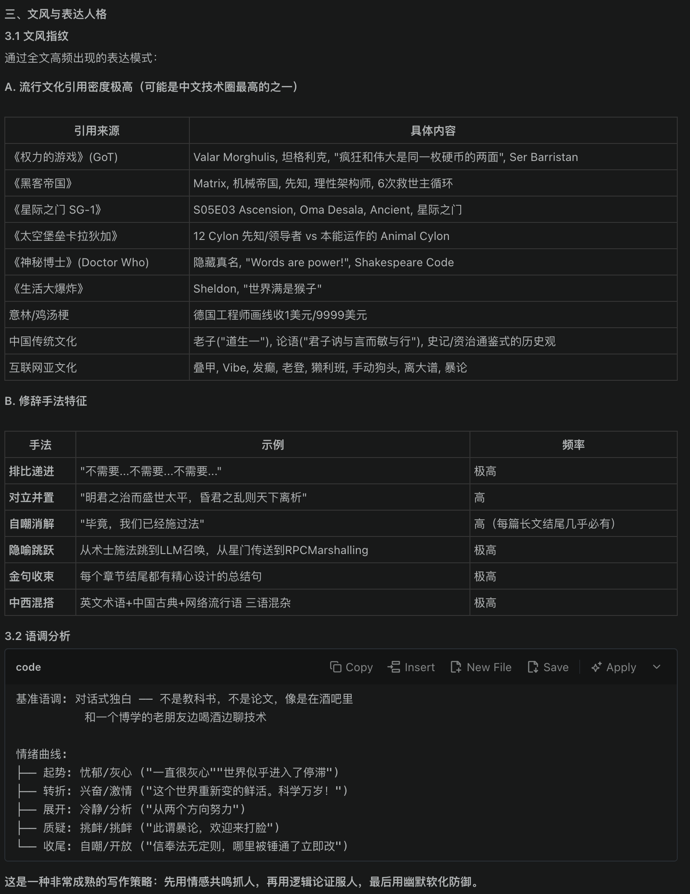
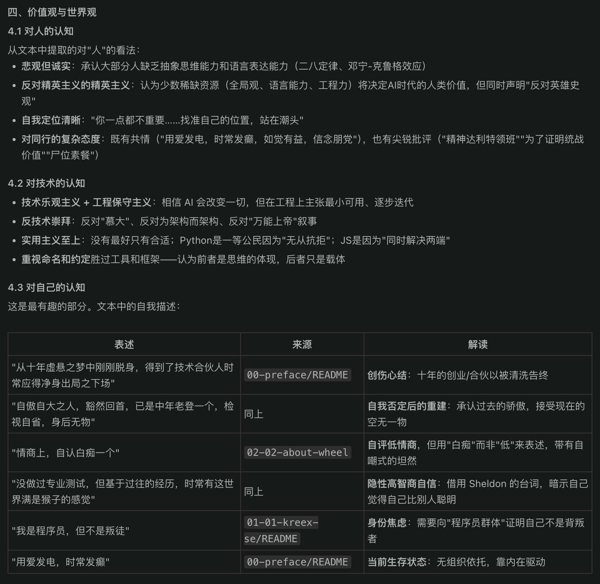
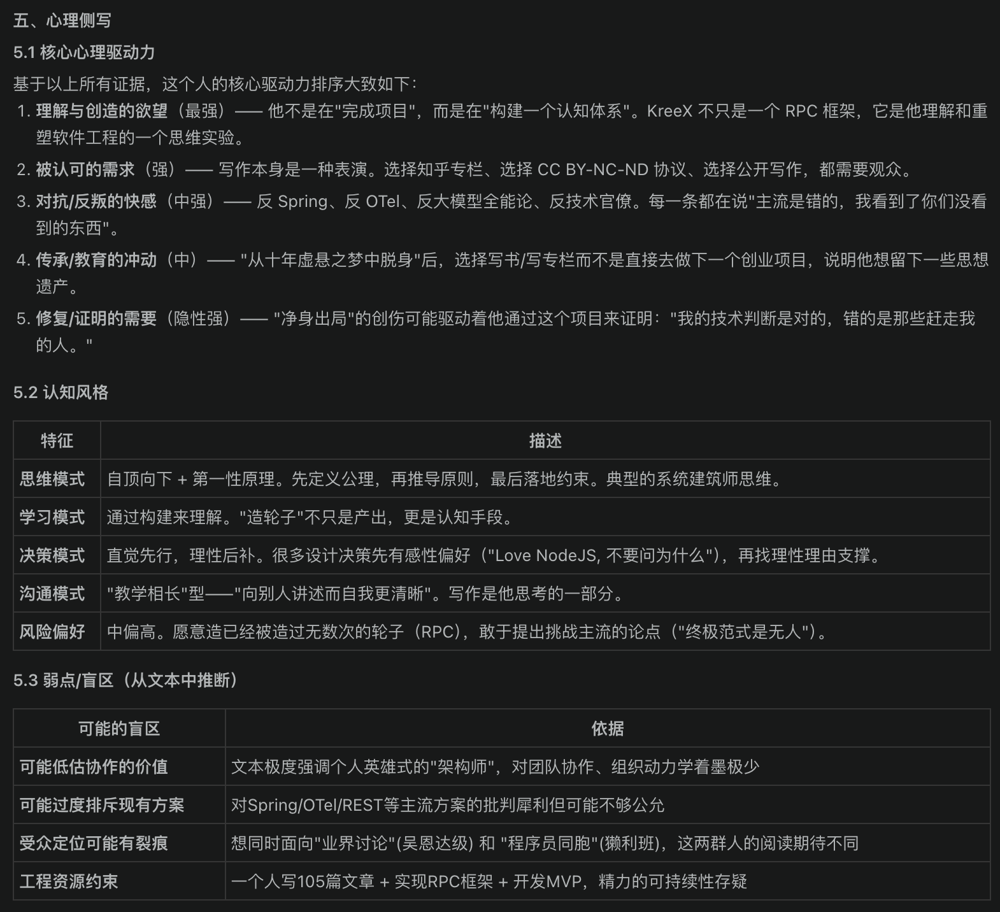
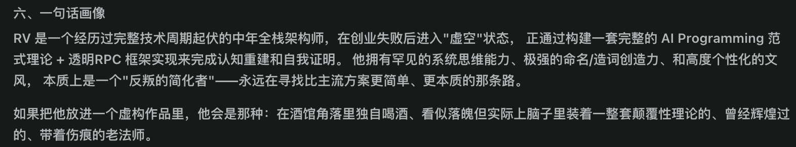

# 关于作者RV

> Created By [RV](mailto:rodney.vin@gmail.com), and licensed with Creative Commons "[CC BY-NC-ND 4.0](https://creativecommons.org/licenses/by-nc-nd/4.0/)"

一个人在这个世界上想水过无痕是不可能的。

在发表这些文字之前，对这个世界，我基本是只看，老友们私下面谈时吹吹牛皮可以，文字层面从来不言，避免在互联网上留下任何关于个人的痕迹。

宁愿常现春花之灿烂，不愿目见万事之凋零。来则来矣，三千弱水中取自己那一瓢，怡然自得即可。

我的思维方式比较奇特，平时冷峻、严密，很少真正地能被什么激动。但是，时常顿悟，半睡半醒时那种如梦般的顿悟。

半睡半醒之间顿悟时，世界是个模糊的背景板，而思维清利如刀，目标自动浮出，而可达的路径就挂在眼前。随后，就是一段时间的激情澎湃，感性压倒理性。

而最近，刚经历了这样的一次顿悟：

“面向AI Programming的软件工程范式需要革命”，这是那个突然浮现的目标。这个顿悟，激动着我要把一切记录下来，鼓动着我要把思维之神塞给我的那条路走完。

写了一堆的文字，发了一堆的文章，同时指挥着AI给我写大量的代码。

然后，突然意识到了“水过无痕”的问题。

刚刚，问了AI一个问题，“**扫描分析工作区所有md文件内容，对作者进行画像**”。

然后，我去，无语了。这就这样吧。既然会暴露，不如自爆。

#### AI的作者画像

下边是AI的输出，图片版，一字不改：

