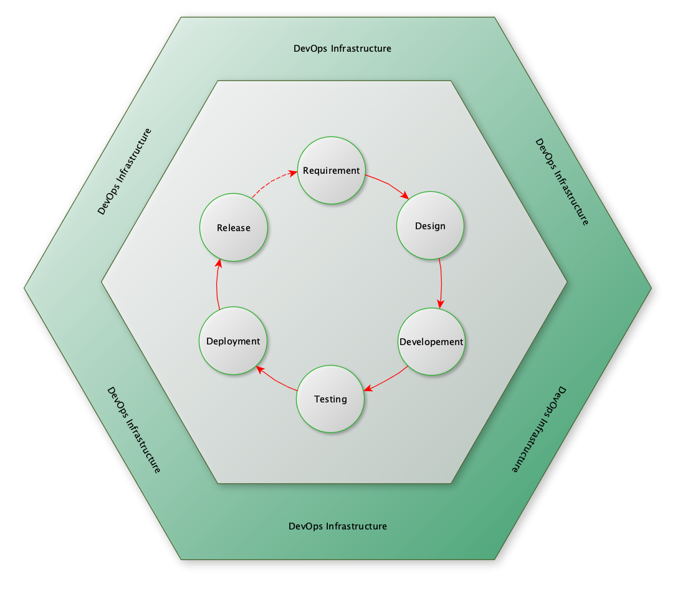
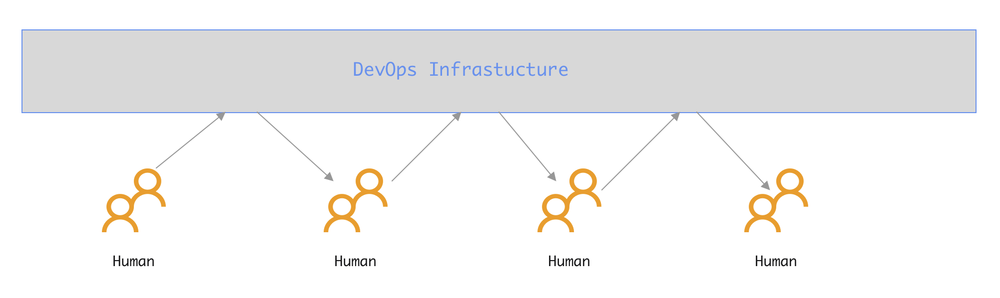
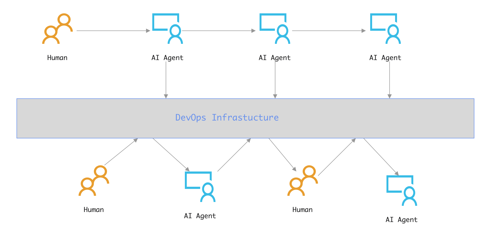

# 四种范式

> Created By [RV](mailto:rodney.vin@gmail.com), and licensed with Creative Commons "[CC BY-NC-ND 4.0](https://creativecommons.org/licenses/by-nc-nd/4.0/)"

我们先画个圈，用这个圈圈住传统的软件工程相关物、事、人、以及外围的支持系统DevOps相关一整套软硬件基础设施。

以人、AI Agent在圈里圈外，以及信息在人、AI Agent之间流动的方式为标准，很简单的就可以区分AI时代的软件工程范式。

​						---------作为分割线的那个圈

扳着指头简单算一下，四种，如下：

1. 纯人：工匠精神
2. AI辅助：AI混入流程
3. AI驱动：AI跳出流程
4. 混合：外圈AI驱动，内圈AI辅助

#### 一：纯人：工匠精神

此种范式，是传统的软件工程范式，纯人模式。以后可能仅存在于各种极端场景：

- 学校，培养新人，不得不做。
- 大神，兴趣爱好，小众的极致追求，炫技。
- 其它，屎山代码问题
- ...

#### 二：AI辅助：AI混入流程

此种范式，是当前的主流。实质是改良。

核心思想，在现有整体流程的局部环节应用AI Agent，替代或者减轻对应环节人的工作。

软件行业内的Vibe，或者编写spec、plan都属于这个范畴。

基本模式，沿用传统的软件工程，将传统的《需求分析文档》、《产品设计文档》作为Dev阶段的输入：

- Vibe，人理解需求，拆分模块，vibe给AI Agent，输出源码
- Spec+Plan:
  - 慕强、幕大，强调使用高性能的的LLM以提供更高的理解、推理能力。
  - 由越来越强大的LLM理解人类用自然语言编写的需求、想法、问题。基于逐步深入的人机对话，逐步澄清模糊点，识别潜在矛盾，推演系统的边界。最终在人的领域知识补充、审查、决策下，形成并结构化地输出一份包含功能定义、技术约束、接口设想和验收标准的详细技术规格文档。
  - 基于已确认的Spec，生成可自动执行的Plan，包括任务分解、模块设计、代码文件结构、甚至推荐技术栈和潜在风险点。
  - 本质是传统的Dev思维，认为Dev阶段的输入是无法结构化、无二义化的，只能在Dev阶段处理。
  - 基本思维方式是提供强大的通用能力，来解决通用问题。

#### 三：AI驱动：AI跳出流程

没有AGI的前提下，此种范式，似乎已是通过工程优化手段所能达到的当前极限。但其实质是革命。

核心是跳出圈外，人定义需求约束AI后，由AI自动生成软件系统。需求节点后，全程自动化。

可以认为DevOps是黑盒。需求明确后，在软件构建完成可供人类使用前，人类不再介入。

传统的DevOps体系则成为一个类似build过程中temp、dist目录性质的存在：

- AI中间、最终产物输出的目的地
- AI思考过程、处理步骤、处理结果的备案记录平台，留下痕迹，以备审查
- 提供一个人类与AI双向动态接管的中介平台

#### 四：混合：外圈AI驱动，内圈AI辅助

此种模式，估计才是5-10年业界的主流形态。其实质是妥协。

好处如下：

- 风险最小。外圈生态对现有技术体系，无侵入，无破坏。
- 保留企业现有能力。外圈崩溃时，内圈随时可以作为候补、应急
- 混合工作模式，为未来AI升级训练留存数据，更有利于AI的成长。

#### 原则+范式的应用对象

后续，我们实际是在讨论范式三、范式四相关的，应该可以形成共识的原则(Laws)、以及各种可以变通的具体指导规则Rules。

周知。
