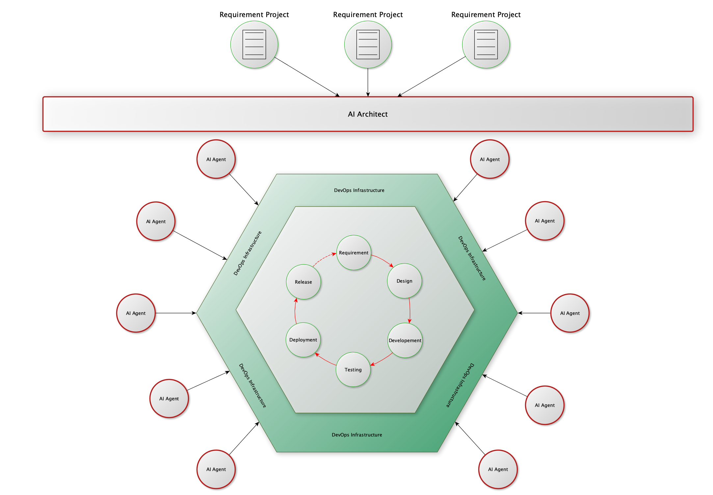

# Rule 16: 双圈运行，向后兼容，扩展而不是替代

> Created By [RV](mailto:rodney.vin@gmail.com), and licensed with Creative Commons "[CC BY-NC-ND 4.0](https://creativecommons.org/licenses/by-nc-nd/4.0/)"

AI是金兵。

软件行业原本是繁荣昌盛的大宋，现在则是靖康被斩首后，留下的那一副完整的躯壳。

而现在，我们所有人的叽叽歪歪，基本都是“臣构言”。

AI摧毁了软件行业原本我们信奉的各种金规铁律、各种的最佳实践、还有各种的价值信念。

“***你们想想，你带着老婆出了城，吃着火锅还唱着歌，突然就被麻匪劫了……***”

师爷屁股不疼，是因为屁股在树上呢，而我们之所以屁股不疼，是因为被斩了首级。

即使范式三所描述的人类定义需求，AI全程自动化处理的人与AI协作的模式现在就能够大规模落地应用，在现阶段，立即就将软件行业原有的运行机制连根拔起，完全摧毁，这是非常不明智的。

#### 拥抱而非排斥

面对历史车轮的时候，个人的抵抗是微不足道的，抵抗者会被碾为齑粉，而披发入山式的避世，则是所谓的闭上眼睛就是天黑。

面对技术变革的时候，如果似“煌煌大清”一样转向自闭，其后果，我们每个人都历历在目。

软件行业，是一个集合了大量的高智商精英，思想高度开放的行业。

过去的数十年间，内部自我革新，允许各种试错，并行探索各种路径，最终形成各种技术流派共存、共同繁荣的产业生态。

不讲最好，只讲适用的工程实用主义，是软件行业的一个基本共识。

在AI技术的进展，为我们提供了无限可能的时候，主动拥抱变革，将AI作为工具，来实现行业的自我革新、效率最大化，探索形成新约束下各种最佳实践，沉淀新的价值与信念，才是我们当下应行之事。

#### 在外层扩展

AI辅助，在AI的帮助下工作，这是改良和改善。

在局部的环节，应用AI，部分替代人类工作，提高自动化程度，是在不改变现有软件工程流程的前提下，采用的渐进改进。

这会加快现有的DevOps体系支撑下的，现有的软件流程流转的速度，提升效率。

这不会带来颠覆性的破坏。

而AI驱动，会带来完全的颠覆。

如[Rule 9](https://zhuanlan.zhihu.com/p/2029959525109847568)、[Rule 13](https://zhuanlan.zhihu.com/p/2030306923849987418)、Rule 14所描述的完全人类定义规则、AI全自动运行的情境，现有体系的各种方法、流程、设施，从本质上来讲可有可无。

这是一种颠覆、一种破坏性的革命。

软件行业内，从来都没有这种大破大立式的采用一个新的范式、体系。我们基于工程实用主义，控制风险，逐步演变。

可行的方式，保持AI辅助模式下，对现有开发流程的机制提效，不去摧毁现有的运作方式。

所以，在现有体系之外，构建一个独立运行的、包裹在外的外部圈层，进行小范围验证价值，同时与旧体系对比，积累数据和信心，并逐步磨合。

团队在保留既有技能、保留对现有流程安全感的前提下，逐步接触和转向新范式，避免了因激进变革引发的强烈抵触和系统性风险。

#### 向后兼容

物理学上有一个有趣的现象。

一种新理论的出现，其目的，不是证明一种旧理论是错误的，而是为了使用更简洁的方式去解释旧理论可以解释的现象。

在大众的层面，以为地心说是错误的，日心说是正确的，牛顿的经典理论是错误的，爱因斯坦的相对论是正确的。

在科学层面，这种认知太过简化。

我们不会讲地心说是错误的，只会讲使用地心说来描述我们的Solar System的时候，需要附加大量的修正，其理论太多补丁，不够优美。

我们不会讲经典理论是错误的，只会讲它是相对论在低速弱场下的理论近似。

在软件工程领域，其理亦如是。

新的范式必须能与旧系统共存和交互。这不是技术上的妥协，而是生态演进的策略——通过与旧体系共存，并证明其优越性，逐步完成替代。

#### 双圈运行

我们不讨论宏大叙事，对于一家具体的软件企业来讲，眼前的点点琐事，才是企业赖以生存的根基，才是企业必须处理的麻烦。

对于一家软件企业，采用大毛的休克疗法，那是被美帝把脑子忽悠成了浆糊。

保留现有体系的正常运行，基于现有体系，保留基本的开发能力，是一个企业最基本的、用来兜底的后备方案。

在现有体系下，采取AI辅助的思路，在局部进行改进，这是最理智的、渐进改革之路。

在现有体系之外，小量投资，试验性质的落地AI驱动的全自动方案，这是面向未来。

内圈与外圈并存，双圈运行，使用现有DevOps基础设施作为内圈与外圈的沟通、共存的交换媒介，这是最大程度保护企业既有投资，最小化变革风险的理智选择。

#### 总结

任何技术改进，技术革命的成功，不取决于其理想的纯粹度，而取决于其对现有组织、流程和人员的兼容与过渡能力。

规避风险、保护投资、渐进改进、直至变革。

这很稳妥，也很理想。
