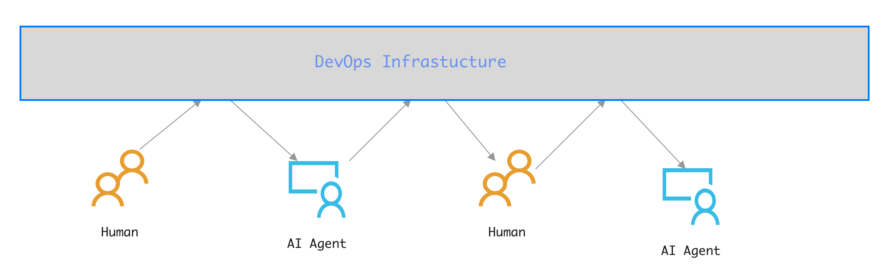
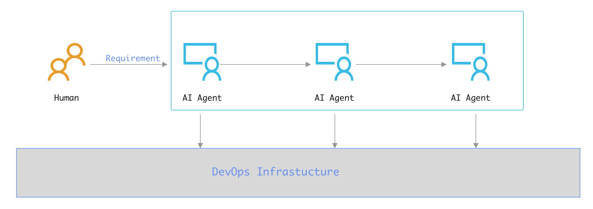

# Rule 20: 复用DevOps平台作为留痕与协作平台

> Created By [RV](mailto:rodney.vin@gmail.com), and licensed with Creative Commons "[CC BY-NC-ND 4.0](https://creativecommons.org/licenses/by-nc-nd/4.0/)"

AI Agents，其实它们可以抛开人类，自娱自乐的。

在AI助手的辅助下，人类完成对需求的结构化定义，自动化的齿轮开始转动，在产出结果提交给人类进行校验之前，AI不再需要人类的干预。

在AI Architect的调度下，启动流水线作业，完成模块的Coding、编译、测试、部署、集成测试；最终由AI Architect调度总装Agent，完成软件系统的整体装配，最终向人类整体交付可用的、运行中的软件服务。

从AI的角度看，人类很多余。

从人类的角度看，这很不靠谱。

可控、留痕、监督、检查、审计，事后可还原追溯，这是任何一个人类系统运作必须配备的核心设施与核心约束机制。

为AI的自动化运作重新发明一套追踪系统，可以做，但好像没必要，因为我们有DevOps平台。

按照现有DevOps体系的职责划分，要求AI Agents将其各个阶段的产出，通过DevOps体系各个阶段的接口注入，我们即可实现对AI Agents阶段性工作成果的检查和控制。

我们将LLM + AI Agents视为在软件工程之外的一种基础设施，其可观测性、可控制性的强制要求已在[Rule 17: AI自动化流程的可观测性是强制约束](https://zhuanlan.zhihu.com/p/2031012147669512757)与[Rule 18: 随时双向接管能力是强制约束](https://zhuanlan.zhihu.com/p/2031052727707514672)中明确限定。

此处仅考虑复用DevOps平台，从而提供Agent输出留痕，以及支持人机协作。

#### AI辅助与AI驱动的差异

AI辅助是范式二，AI Agents混入流程。

AI驱动是范式三，AI Agents跳出流程。

在两种范式下，AI Agents如何与DevOps平台进行互动，完全不同

##### AI辅助

AI辅助时，DevOps平台驱动流程。Agent只是一个数字员工，在整个开发流程中的角色与人类员工，没有本质的不同。从DevOps平台获取任务，产出注入DevOps平台，由平台驱动与触发下一阶段的任务。

##### AI驱动

而AI驱动时，AI Agents自组织、自协作。

此时，在流程设计、Agent设计阶段，强制要求Agent的产出必须存入DevOps平台，这是将DevOps平台作为一个备案平台，留痕以备审查。

对DevOps平台进行必要的适应性改造，设定自动拦截AI输出的机制，AI在检测到输出被拦截后，自动终止后续流水线运作，这同时也为我们提供了一种不增加新的复杂性与成本，即可控制AI自动协作系统的简单手段。

#### 双圈运行的核心介质

不论是基于DevOps平台体系的传统全人工开发，在局部应用AI进行AI辅助，这都构成一种不破坏现有软件工程体系的内圈运行机制。

在内圈的保护下，不论是传统的纯人工还是AI局部替代的半自动模式，都可以继续顺畅运行。

我们试图引入AI驱动下，需求后全自动运行的范式三时，如果不加以约束和设置，可能会对团队现有的开发能力造成休克式的冲击。

而DevOps体系平台则提供了可能的缓冲、控制、交互媒介。

在我们有意识的设计下，使用DevOps基础设施对内外进行隔离。

将AI驱动范式相关的全套流程隔离在外，其产出被强制注入现有DevOps体系。

由此，我们便能以DevOps平台为核心介质，构建一条内外圈独立运行、双向信息互换、协同工作、逐步改良，并能在内外之间动态平衡开发资源的稳健演化之路。
