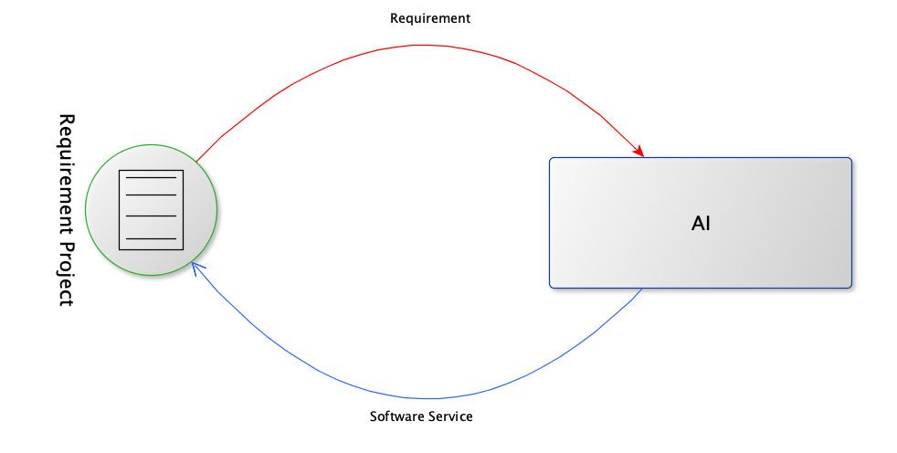
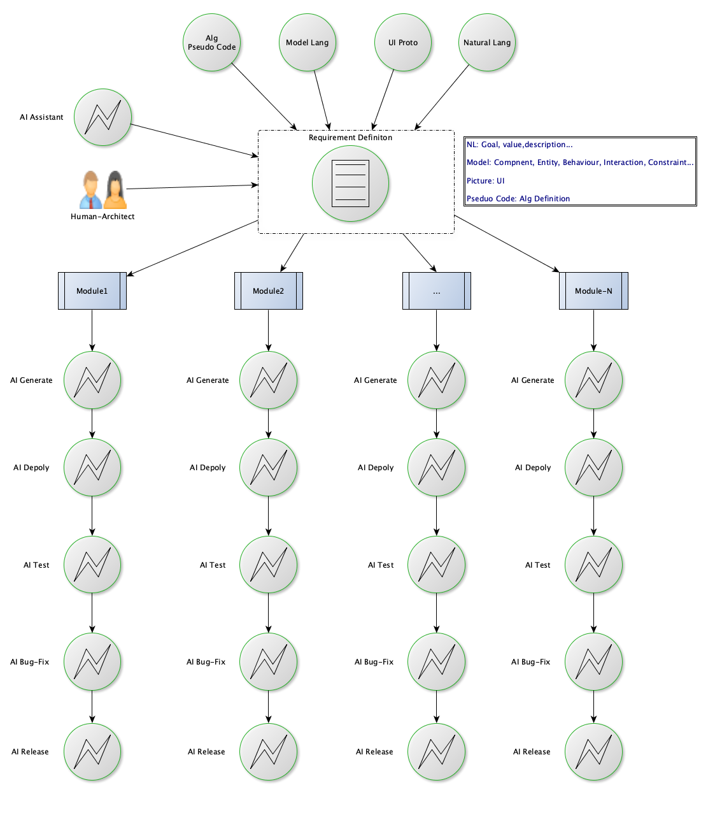

# KreeX：面向AI Programming的软件工程范式

> Created By [RV](mailto:rodney.vin@gmail.com), and licensed with Creative Commons "[CC BY-NC-ND 4.0](https://creativecommons.org/licenses/by-nc-nd/4.0/)"

面向AI Programming的软件工程范式应该是什么样子，类似于哈姆雷特，一千个人的心中有一千个哈姆雷特。

具体到个人，我已经摆明了立场，旗帜鲜明地选了边：选AI那一边，坐在“***终极范式是无人***”那一桌。

我是程序员，但不是叛徒。只是历史的车轮面前，螳臂当车，只会化为车辙中的泥尘。

#### 世界重新鲜活

现代的标准物理模型已经走到无法自证的泥沼，更多的理论仅在数学层面自洽，无法证实也无法证伪。而没有基础物理理论的革命性的重大突破，科技层面很难再有重大的创新。

所以，一直很灰心。

在IT圈内，自从摩尔定律不再生效，感觉这个世界似乎进入了停滞，甚至某种程度上开始崩坏，一切色彩鲜明的事物都在逐步暗淡。

LLM所引发的人工智能层面的变革，让我们觉得世界开始重新充满了活力，和无限的可能。

在软件开发及软件工程领域数十年的从业经历中，从来没有见过，也没有想象过，会有一条如此方向明确、工程可行、万事可期的颠覆性之路在我们面前铺开。

这个世界重新变得鲜活。科学万岁！

#### 折中与技术债

当前，所有我们所做的，本质是折中，是在创造一种技术债。

因为，虽然AI还在不断地增强，但是AGI还没戏，短期内看不到任何希望，甚至业界已经有人在质疑LLM之路是否已经走到了尽头。

AGI，我们可以期待和等待，但是我们不能无所事事。

在软件工程流程中，既然暂时做不到完全的无人，那我们就追求极致的自动化、尽量减少人的环节。

**“面向AI的Programming需要整个软件工程范式的革命”**，应是我们共识的底线。

不管，最终它会是什么样子，基于当前“**人+AI协作**”这一基本的前提，我们可以开始设计工程层面的核心范式，并且在MVP工程中去实验、检验它。

并且尽量在此范式中，保留随时移除人的环节的可能性、可扩展性。

双圈运行，传统DevOps留痕、控制、审计

​		AI辅助下的需求工程，需求定义阶段封装系统复杂性

我们会从下述几个方面，进行讨论：

1. [关于作者RV](00-about-author.md)
1. [AI建议的自我指涉](00-about-author-2.md)
1. [四种范式](01-classify-se.md)
2. [AI驱动范式下的核心原则](02-laws.md)
2. [Rule 1: 软件成为灰盒，甚至黑盒](./03-rule1-gray-box.md)
3. [Rule 2: 需求定义是唯一的人机契约](./04-rule2-human-machine-constract.md)
4. [Rule 3:  需求定义语言=自然语言+图形UI原型+模型语言+算法伪代码](./05-rule3-no-pure-nl.md)
5. [Rule 4: 需求定义的生成模式：AI辅助生成，人类决策确定](./06-rule4-req-produce-mode.md)
6. [Rule 5: 需求管理是核心：Requirement Over Development](./07-rule5-req-over-dev.md)
7. [Rule 6: Kill IDE, Let IRE Be Born:  Integrated Requirement Environment](./08-rule6-kill-ide.md)
8. [Rule 7: 架构师+AI Agents](./09-rule7-arch-agents.md)
9. [Rule 8: 架构师是唯一的人类：去除人<-->人沟通环节，避免知识传递及重新理解](./10-rule8-only-person.md)
10. [Rule 9: 架构师之后全程自动化](./11-rule9-auto-after-arch.md)
11. [Rule 10: 无人Coding，除非迫不得已](./12-rule10-noone-coding.md)
12. [Rule 11: 将LLM+AI Agents视为软件工程之外的基础设施](./13-rule11-its-infrastructure.md)
13. [Rule 12: 使用透明RPC微服务架构简化需求定义、及代码生成](./14-rule12-use-rpc.md)
14. [Rule 13: AI Agents需要分工：限定领域的准确度优先](./15-rule13-split-agents.md)
15. [Rule 14: AI Agents直接通信协作](./16-rule14-agents-direct-comm.md)
16. [Rule 15: 纯人->人机协作->无人：极限逼近无人模式使用MDA的方法论：CIM->PIM->PSM](./17-rule15-human-2-ai.md)
17. [Rule 16: 双圈运行，无阻力升级：外圈AI范式，内圈传统DevOps体系，外圈输出注入内圈](./18-rule16-two-loop.md)
18. [Rule 17: AI自动化流程的可观测性是强制约束](./19-rule17-obversable.md)
19. [Rule 18: 随时双向接管能力是强制约束](./20-rule18-take-over.md)
20. [Rule 19: 验证与生成环节环节的LLM必须不同](./21-rule19-two-llm.md)
21. [Rule 20: 使用DevOps平台作为留痕平台](./22-rule20-log-2-devops.md)
22. [Rule 21: 程序员不会消失，只会进化](./23-rule21-evolve.md)

#### 相关背景

开启此专栏的相关背景，参阅专栏《[KreeX](https://www.zhihu.com/column/c_2027047082775651621)》

1. [声明在前](https://zhuanlan.zhihu.com/p/2027049091390084530)
2. [先行叠甲](https://zhuanlan.zhihu.com/p/2027050132416262176)
3. [关于AI Programming](https://zhuanlan.zhihu.com/p/2027051264924480881)
4. [Coding与Programming](https://zhuanlan.zhihu.com/p/2027053441390768843)
5. [工程，而不是技术能力](https://zhuanlan.zhihu.com/p/2027053719439643604)
6. [面向AI Programming的软件工程](https://zhuanlan.zhihu.com/p/2027385727923570610)
7. [面向AI Programming的服务调用](https://zhuanlan.zhihu.com/p/2027763667572208559)
8. [要做什么](https://zhuanlan.zhihu.com/p/2027767914812511253)
9. [名字的由来](https://zhuanlan.zhihu.com/p/2027768382783595045)

#### **工程验证**

##### **透明RPC微服务框架**

面向AI Programming 的透明RPC微服务框架，相关技术已实现。详细论述，参见姊妹专栏《[KreeX: 透明RPC微服务架构](https://www.zhihu.com/column/c_2027391524585969485)》。

##### **软件工程范式**

基于本范式的 MVP 项目正在开发中。工程实践中的发现将随时调整范式清单， 本文所列范式将持续迭代。

毕竟，在[先行叠甲](https://zhuanlan.zhihu.com/p/2027050132416262176)之处，我们已经施法， "信奉法无定则：思想要进化，身段要柔和。哪里被锤通了，咱们立即改。"